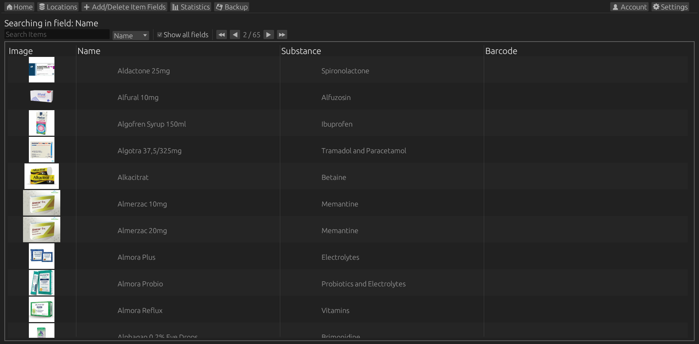

A website that can keep track of items and values associated with them, while keeping track of their location in the physical world.

Features:
  * Add user defined fields including: Text, Decimal, Integer, Checkbox, Paragraphs, Percentages or Images.
  * Search trhough, or sort items, based on user data.
  * Have access to statistics about your itmes and their properties.

Web features:
  * Multi device login.
  * Export and download your complete database and image files at will.
  * Customizable user interface.

  

